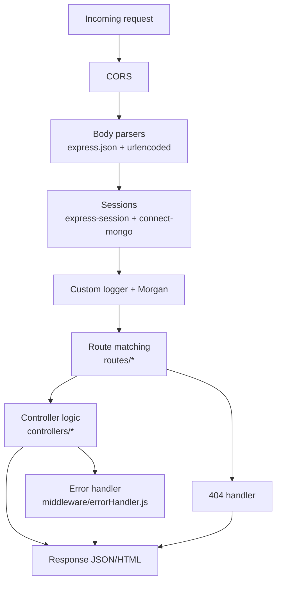
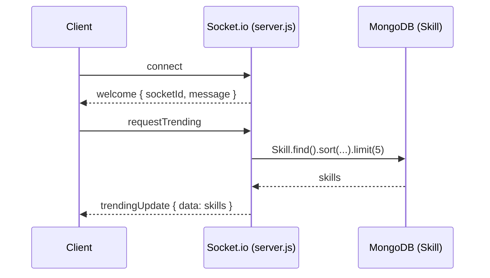
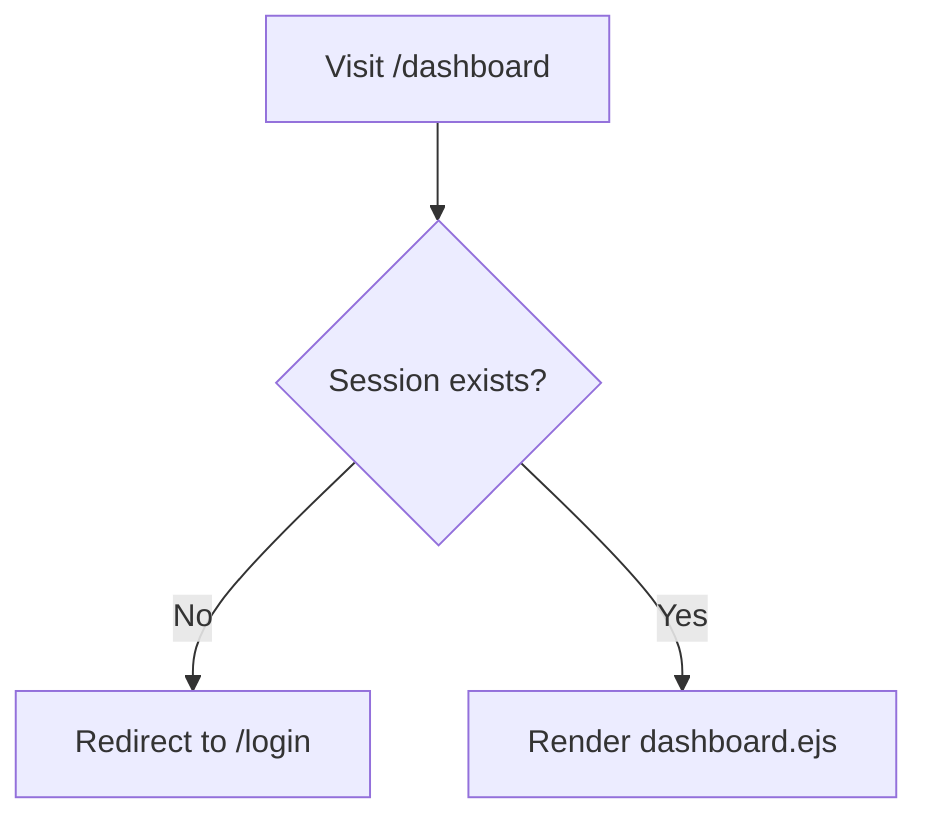

# SkillIntel — Endpoints, Filesystem, and Workflows

This document is an onboarding-oriented reference that consolidates:

- **All HTTP endpoints** (API + SSR) and what they do
- **WebSocket events** (Socket.io)
- **Filesystem map** (where to find what)
- **End-to-end workflows** (server request lifecycle, user flows, trends pipeline)

It intentionally focuses on the “how it works” and “where to look” parts that are easy to miss when only reading `README.md` / `REPORT.md`.

---

## 1) System map (big picture)

```mermaid
flowchart LR
  U[User Browser] -->|SPA| FE[React + Vite\nclient/]
  U -->|SSR pages| SSR[EJS views\nviews/]

  FE -->|HTTP /api/*| API[Express App\nserver.js]
  FE <-->|Socket.io| WS[Socket.io Server\nserver.js]
  SSR -->|HTTP| API

  API --> MW[Middleware stack\nmiddleware/]
  MW --> R[Routes\nroutes/]
  R --> C[Controllers\ncontrollers/]
  C --> M[Models\nmodels/]
  M --> DB[(MongoDB Atlas)]

  API -->|arms| SCH[jobs/scheduler.js\n(node-cron)]
  SCH --> TP[services/trendsPipeline.js]
  TP --> EXT[External Sources\nAdzuna/JSearch/GitHub/SO/GoogleTrends]
  EXT --> TP --> DB
```

---

## 2) Filesystem map (what lives where)

### Backend (root)

```
server.js                 # Express app + middleware + routes + socket.io + boot
seed.js                   # Seeds skills/users

routes/                   # Route definitions (HTTP paths)
  authRoutes.js
  skillRoutes.js
  dashboardRoutes.js
  insightRoutes.js        # API routes for AI insights

controllers/              # Route handlers (business logic)
  authController.js
  skillController.js
  dashboardController.js

models/                   # Mongoose models
  User.js
  Skill.js
  SkillTrend.js
  WeeklyInsight.js        # AI-generated weekly insights

middleware/               # Cross-cutting middleware
  authMiddleware.js       # JWT verification, sets req.user
  sessionCheck.js         # SSR session guard
  logger.js               # request logging
  errorHandler.js         # centralized error formatting

services/                 # “Integrations” + pipeline modules
  trendsPipeline.js       # orchestrates trend computation and persistence
  jobFetcher.js           # Adzuna + JSearch fetching, filtering, dedupe
  githubTrends.js         # GitHub Search API signal
  stackoverflowTrends.js  # Stack Exchange API signal
  googleTrends.js         # calls trend-service (FastAPI) signal
  trendScorer.js          # converts signals → trendScore, direction, percentChange
  skillExtractor.js       # extracts skills from job descriptions
  (and other formatting/normalization helpers)

jobs/
  scheduler.js            # cron schedule + startup “freshness” run logic
  weeklyInsightsJob.js    # automated AI news generation via Gemini

utils/
  eventBus.js             # internal event emitter decoupling jobs and Socket.io

views/                    # SSR templates
  login.ejs
  dashboard.ejs

data/
  skills.json             # seed data

client/                   # React SPA (Vite)
trend-service/            # optional Python FastAPI service (Google Trends via pytrends)
```

---

## 3) Backend request lifecycle (server workflow)

### Express pipeline (in order)



### Key rules

- **Middleware order matters**: body parsers must run before controllers that read `req.body`.
- **API vs SSR**:
  - `/api/*` returns **JSON**
  - SSR routes (`/login`, `/dashboard`) return **rendered HTML**.
- **JWT vs Session**:
  - SPA calls use **JWT** (`Authorization: Bearer …`)
  - SSR dashboard uses **sessions** (cookie `connect.sid` stored in MongoDB via `connect-mongo`)

---

## 4) HTTP endpoints (complete list)

Base URL (local): `http://localhost:3000`

### 4.1 Skills endpoints (mounted under `/api`)

| Method | Path | Auth | Handler | Description |
|---|---|---|---|---|
| GET | `/api/skills` | Public | `skillController.getAllSkills` | Returns all skills from MongoDB |
| GET | `/api/skills/:name` | Public | `skillController.getSkillByName` | Case-insensitive exact name lookup |
| GET | `/api/trending` | Public | `skillController.getTrendingSkills` | Sorted by `trendScore` (fallback to legacy fields); supports `?limit=` |
| GET | `/api/skills/trending` | Public | alias | Backward-compatible alias |
| GET | `/api/compare?skills=A,B` | Public | `skillController.compareSkills` | Compare multiple skills |
| GET | `/api/skills/compare?skills=A,B` | Public | alias | Backward-compatible alias |
| GET | `/api/recommended/:skill` | Public | `skillController.getRecommendedSkills` | Companion skills for the given skill |
| GET | `/api/skills/recommended/:skill` | Public | alias | Backward-compatible alias |
| POST | `/api/skills` | JWT | `skillController.createSkill` | Creates a skill document |
| POST | `/api/admin/trends/refresh` | JWT + **admin** | `skillController.refreshTrends` | Triggers trends pipeline (returns 202 / already-running) |

Notes:

- `POST /api/admin/trends/refresh` explicitly checks `req.user.role === 'admin'`.
- `POST /api/skills` is JWT-protected; role enforcement may be expanded depending on requirements.

### 4.2 Auth + Profile endpoints (mounted under `/api/auth`)

| Method | Path | Auth | Handler | Description |
|---|---|---|---|---|
| POST | `/api/auth/register` | Public | `authController.register` | Creates user |
| POST | `/api/auth/login` | Public | `authController.login` | Returns JWT; also creates SSR session |
| POST | `/api/auth/logout` | Public | `authController.logout` | Destroys SSR session + clears cookies |
| GET | `/api/auth/profile` | JWT | `authController.getProfile` | Returns user + profile shape (v2) |
| PUT | `/api/auth/profile` | JWT | `authController.updateProfile` | Updates profile fields |
| POST | `/api/auth/profile` | JWT | `authController.createOrUpdateProfile` | Upsert-style profile write (201 first, 200 update) |
| POST | `/api/auth/profile/resume` | JWT | `authController.uploadResume` | Upload resume (multipart field name: `resume`, ≤5MB, PDF/DOC/DOCX) |
| GET | `/api/auth/profile/resume` | JWT | `authController.downloadResume` | Download resume bytes |

### 4.3 Insights API (mounted under `/api/insights`)

| Method | Path | Auth | Handler | Description |
|---|---|---|---|---|
| GET | `/api/insights/latest` | Public | `insightRoutes.js` | Returns the most recent AI-generated weekly tech news |
| POST | `/api/insights/generate` | Admin | `insightRoutes.js` | Manually triggers the Gemini insights job (testing/override) |

### 4.4 SSR endpoints (mounted under `/`)

| Method | Path | Auth | Handler | Description |
|---|---|---|---|---|
| GET | `/login` | Public | `dashboardController.renderLogin` | SSR login page |
| GET | `/dashboard` | Session | `sessionCheck` → `dashboardController.renderDashboard` | SSR dashboard page (redirects to `/login` if no session) |

### 4.5 404 behavior

- For unknown `/api/*` routes: returns JSON `{ success: false, message: 'API route not found' }` with **404**
- For unknown non-API routes: returns a basic HTML 404 page

---

## 5) WebSocket events (Socket.io)

Socket.io is attached to the same HTTP server in `server.js`.

| Event | Direction | Purpose |
|---|---|---|
| `welcome` | Server → Client | Sent on connection with socket id |
| `requestTrending` | Client → Server | Client requests latest trending skills |
| `trendingUpdate` | Server → Client | Server emits latest trending list |
| `new-insight` | Server → Client | Server broadcasts new AI weekly insight |
| `disconnect` | Both | connection closed |



---

## 6) User workflows (how the app behaves)

### 6.1 SPA (React) user flow — register → login → browse

```mermaid
flowchart TD
  A[Open React app\n:5173] --> B[Register\nPOST /api/auth/register]
  B --> C[Login\nPOST /api/auth/login]
  C --> D[JWT stored client-side\n(used for API calls)]
  D --> E[Browse skills\nGET /api/skills]
  E --> F[View details\nGET /api/skills/:name]
  E --> G[Compare\nGET /api/compare?skills=A,B]
  E --> H[Trending\nGET /api/trending?limit=N]
  D --> P[Profile\nGET/PUT/POST /api/auth/profile]
  P --> R[Resume upload/download\nPOST/GET /api/auth/profile/resume]
```

Notes:

- SPA authentication uses **JWT**. Protected endpoints require `Authorization: Bearer <token>`.

### 6.2 SSR (EJS) dashboard flow — session-based



Notes:

- Sessions are stored in MongoDB via `connect-mongo`.
- Login endpoint sets both:
  - a **JWT** (for SPA)
  - a **session** (for SSR dashboard)

---

## 7) Trends engine workflow (scheduled + on-demand)

### 7.1 Scheduler behavior

- Scheduler is armed after MongoDB connects (`server.js`).
- Cron expression defaults to **every 6 hours** (`0 */6 * * *`), overridable by `TRENDS_CRON`.
- On startup it performs a “freshness check” and runs only if no recent `SkillTrend` doc exists within the last 24 hours.

### 7.2 Pipeline data flow

```mermaid
flowchart TD
  START[Trigger] -->|cron tick OR admin endpoint| PIPE[runTrendsPipeline]
  PIPE --> UNIV[Load skill universe\nSkill names from DB\n(or seed list if empty)]
  UNIV --> JOBS[Fetch jobs\nAdzuna + optional JSearch]
  JOBS --> EXTR[Extract skill mention counts\nservices/skillExtractor.js]
  UNIV --> GH[GitHub Search API counts\nservices/githubTrends.js]
  UNIV --> SO[Stack Exchange API counts\nservices/stackoverflowTrends.js]
  UNIV --> GT[Google Trends scores\nservices/googleTrends.js\n(uses trend-service)]
  EXTR --> SCORE[Compute trendScore\ndirection\npercentChange\nservices/trendScorer.js]
  GH --> SCORE
  SO --> SCORE
  GT --> SCORE
  SCORE --> HIST[Insert history snapshots\nmodels/SkillTrend]
  SCORE --> UPD[Upsert latest fields\non models/Skill]
  HIST --> DONE[Done]
  UPD --> DONE
```

### 7.3 External sources & prerequisites (integration workflow)

- **Adzuna**: requires `ADZUNA_APP_ID` + `ADZUNA_API_KEY`
- **JSearch (RapidAPI)**: requires `JSEARCH_API_KEY` and an active RapidAPI subscription plan for that API
- **GitHub**: requires `GITHUB_TOKEN`
- **Stack Overflow**: uses public Stack Exchange API (throttled)
- **Google Trends**:
  - requires running `trend-service/` (FastAPI) separately
  - requires `TREND_SERVICE_URL` (e.g. `http://localhost:8000`)
  - if not set, Google Trends signal is automatically skipped (pipeline still runs)

### 7.4 Weekly AI Insights Workflow

1. `jobs/scheduler.js` triggers `weeklyInsightsJob.js` every Monday at 8 AM.
2. The job queries MongoDB for the top 3 highest-growth skills.
3. Passes the skills to Google Gemini API to generate a professional tech news summary.
4. Saves to the `WeeklyInsight` MongoDB collection.
5. Emits `new-insight` event via `utils/eventBus.js`.
6. `server.js` catches the event and broadcasts it to all connected React clients via Socket.io.
7. `LiveFeed.jsx` component animates the new insight onto the user's dashboard.

---

## 8) Security & data handling (what to know)

- **Never commit secrets**: `.env` must remain private.
- **JWT**:
  - verified by `middleware/authMiddleware.js`
  - decoded payload is attached to `req.user`
- **Resume storage**:
  - uploaded via `multer` in memory
  - persisted as a `Buffer` in MongoDB (inside user profile)
  - downloaded via streaming response with original mimetype/filename

---

## 9) “Where do I change X?”

- **Add/modify an endpoint**: `routes/*` + `controllers/*`
- **Change JWT verification**: `middleware/authMiddleware.js`
- **Change session rules for SSR**: `middleware/sessionCheck.js`
- **Change trending logic**: `services/trendScorer.js` and/or `services/trendsPipeline.js`
- **Add a new trend data source**: create a `services/<source>.js` and wire it in `services/trendsPipeline.js`
- **Change proxying in dev**: `client/vite.config.js`

